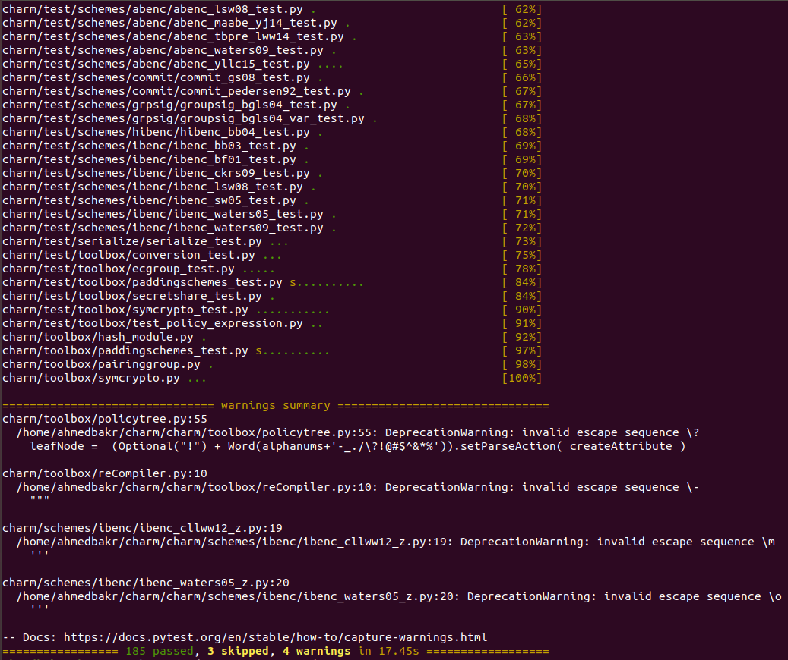
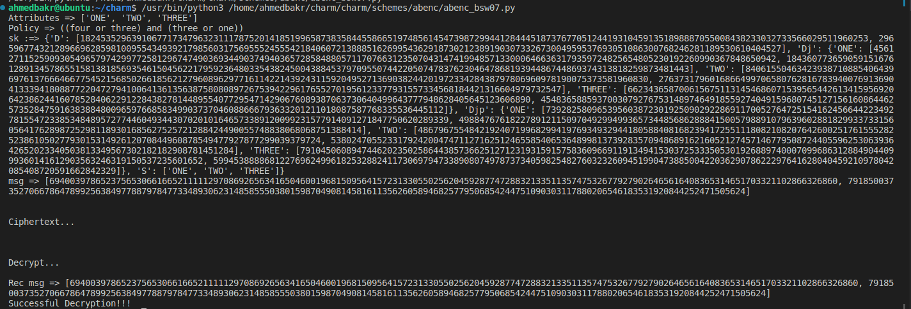

Charm
=====

| Branch      | Status                                                                                                          |
| ----------- | --------------------------------------------------------------------------------------------------------------- |
| `dev`       | [](https://travis-ci.org/JHUISI/charm)        |
| `dev-2.7`   | [](https://travis-ci.org/JHUISI/charm)    |

Charm is a framework for rapidly prototyping advanced cryptosystems.  Based on the Python language, it was designed from the ground up to minimize development time and code complexity while promoting the reuse of components.

Charm uses a hybrid design: performance intensive mathematical operations are implemented in native C modules, while cryptosystems themselves are written in a readable, high-level language.  Charm additionally provides a number of new components to facilitate the rapid development of new schemes and protocols.

Features of Charm include:
* Support for various mathematical settings, including integer rings/fields, bilinear and non-bilinear Elliptic Curve groups
* Base crypto library, including symmetric encryption schemes, hash functions, PRNGs   
* Standard APIs for constructions such as digital signature, encryption, commitments
* A “protocol engine” to simplify the process of implementing multi-party protocols
* An integrated compiler for interactive and non-interactive ZK proofs
* Integrated benchmarking capability

Documentation
=============
**For complete install, see our [documentation](https://jhuisi.github.io/charm/install_source.html). 

Pull Requests
=============

We welcome and encourage scheme contributions. If you'd like your scheme implementation included in the Charm distribution, please note a few things.
Schemes in the dev branch are Python 3.x only** and ones in the 2.7-dev branch are Python 2.x. For your scheme to be included in unit tests (`make test`), you must include a doctest at a minimum (see schemes in the charm/schemes directory). 

Schemes
=======
We have provided several cryptographic scheme [examples](https://jhuisi.github.io/charm/schemes.html) to get you going. If this doesn't help, then feel free to reach us for questions and/or comments at support@charm-crypto.com.

If you're using Charm to implement schemes, we want to know what your experience is with our framework. Your feedback is very valuable to us! 

Quick Install & Test
====================
### Ubuntu 18.04
These configurations were tested on Ubuntu 18.04:
```
sudo apt-get update
sudo apt-get upgrade
sudo apt-get install -y flex
sudo apt-get install -y bison
sudo apt-get install -y byacc
sudo apt-get install -y libssl-dev
sudo apt install -y git
sudo apt install -y python3-dev
sudo apt install -y make
sudo apt install -y libgmp-dev
sudo apt install -y python3-pip

sudo add-apt-repository ppa:deadsnakes/ppa
sudo apt update

git clone https://github.com/JHUISI/charm.git
cd charm

pip3 install -r requirements.txt
pip3 install setuptools

sudo ./configure.sh
cd ./deps/pbc && make && sudo ldconfig && cd -
make
sudo make install && sudo ldconfig
sudo make test
```

If most (or all) Python tests pass, then the Charm installation was successful. Enjoy!

The expected output is shown in the screenshot below:


### Ubuntu 20.04 & 22.04
If you are running Ubuntu 20.04 or 22.04, you can run these commands, which are tried by another student at different time, but it is not verified by me:

```
sudo apt update
sudo apt upgrade 
sudo apt-get install gcc
sudo apt-get install make
sudo apt-get install zlib1g-dev
sudo apt-get install libreadline-gplv2-dev libncursesw5-dev libssl-dev 
libsqlite3-dev tk-dev libgdbm-dev libc6-dev libbz2-dev
sudo apt -y install libssl-dev zlib1g-dev build-essential
sudo apt-get install -y libgmp10 libgmp-dev
sudo apt-get install -y openssl
sudo add-apt-repository ppa:deadsnakes/ppa
sudo apt update
sudo apt install python3.7 python3.7-dev python3.7-distutils
sudo apt install virtualenv
virtualenv -p /usr/bin/python3.7 py37
source py37/bin/activate
sudo apt-get install -y libgmp10 libgmp-dev python3-dev
sudo apt-get install -y openssl
sudo apt install -y git
git clone https://github.com/JHUISI/charm
cd charm
pip install -r requirements.txt
./configure.sh
cd ./deps/pbc
sudo apt-get install flex
sudo apt-get install bison
make
sudo ldconfig
cd -
make
make test
pip3 install -U setuptools
pip install ujson
make install
sudo ldconfig
make test

# run to auto-enter charm directory and activate py37 virtualenv
echo "source ~/py37/bin/activate" >> ~/.bashrc
echo "cd ~/charm" >> ~/.bashrc
```

### Testing ABE Code

Run the python file: `python3 charm\schemes\abenc\abenc_bsw07.py` and the expected program should run successfully. The expected output is shown in the screenshot below:



Licensing
=========

Charm is released under an LGPL version 3 license due to libraries that we build on. See the `LICENSE.txt` for details.
